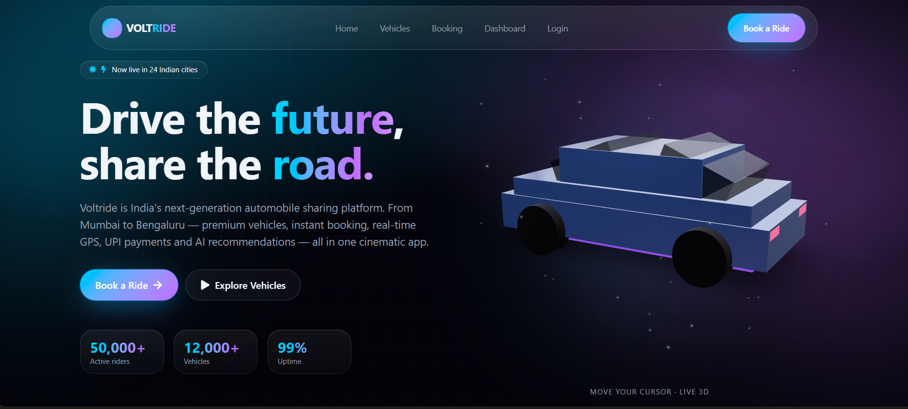

# 🚗 VOLTRIDE — Automobile Sharing Platform

VOLTRIDE is a futuristic automobile-sharing platform designed for Indian cities.  
The platform allows users to explore, book, and manage premium vehicles with a modern cinematic UI and interactive user experience.

---

## 🚀 Live Demo

🔗 https://nexus-ride-motion.lovable.app

---

## 📸 Website Preview



---

## ✨ Features

- 🌟 Futuristic modern UI/UX
- 🚘 Vehicle exploration section
- 📅 Instant vehicle booking interface
- 📱 Fully responsive design
- 🌍 Indian city localization
- 💳 UPI payment-ready concept
- 🎨 Smooth animations and gradients
- 🧠 AI-powered recommendation concept
- 🚗 Interactive 3D vehicle model
- 📊 Dashboard-style experience

---

## 🛠️ Tech Stack

- HTML5
- CSS3
- JavaScript
- React.js
- Tailwind CSS
- Lovable AI

---

## 📂 Project Structure

```plaintext
VOLTRIDE/
│
├── public/
├── src/
├── components/
├── assets/
├── package.json
├── vite.config.js
└── README.md
```

---

## 🎯 Project Purpose

This project was created to showcase a next-generation automobile-sharing experience tailored for Indian users with:
- modern web technologies
- futuristic design
- interactive UI concepts
- responsive layouts

---

## 📱 Responsive Design

The website is optimized for:

- 💻 Desktop
- 📱 Mobile
- 📟 Tablet

---

## 🔥 Highlights

- Modern glassmorphism design
- Neon gradient styling
- Interactive landing page
- Premium automobile branding
- Smooth user experience

---

## 🚀 Future Improvements

- User Authentication
- Real-time Booking System
- Payment Gateway Integration
- AI Vehicle Recommendations
- GPS Tracking
- Admin Dashboard
- Database Integration

---

## ⚙️ Installation

Clone the repository:

```bash
git clone https://github.com/your-username/your-repository-name.git
```

Open project folder:

```bash
cd your-repository-name
```

Install dependencies:

```bash
npm install
```

Run development server:

```bash
npm run dev
```

---

## 🌐 Deployment

This project can be deployed using:

- GitHub Pages
- Vercel
- Netlify
- Lovable

---

## 👨‍💻 Author

### Jasmin Pucchakayala

GitHub:
https://github.com/your-github-username

---

## 📄 License

This project is created for educational and portfolio purposes.

---

## ⭐ Support

If you like this project, give it a ⭐ on GitHub.
